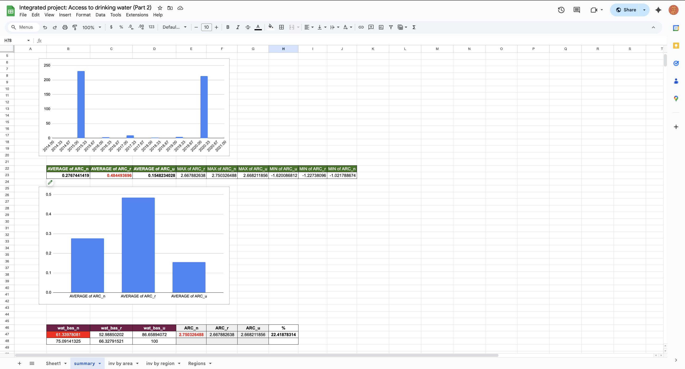

# Access to Drinking Water – Part 2: Transforming the Data (2000–2020)

This project builds on Part 1 by introducing time-series analysis and deeper insights using extended WHO/UNICEF JMP data across 20 years.

>  Completed as part of the ALX Data Analytics Program  
>  Tool: Google Sheets

---

## Objectives

- Import and clean multi-year water access data
- Join country-region mappings using `Regions.csv`
- Create time-based analysis using year differences
- Calculate Annual Rate of Change (ARC) per area
- Identify progress, stagnation, and full access trends
- Group data by region and summarize average change
- Visualize differences between rural and urban improvement

---

##  Files Included

| File | Description |
|------|-------------|
| `Estimates on the use of water (2000–2020).csv` | Main historical dataset |
| `Regions.csv` | Country to UN region mapping |
| `Integrated project - Access to drinking water (Transforming the data).pdf` | ALX project brief for Part 2 |
| `Screenshots/` | Visual output folder (charts, histograms, pivot tables) |
| `README.md` | Project documentation |
| Google Sheets | [🔗 View-only link to the live sheet](https://docs.google.com/spreadsheets/d/1FS87gBpsPKIhm_KwFfBn2CiDnChQiONM3y7mluPXZiQ/edit?usp=sharing) |

---

## Key Features & Logic Used

- `y_diff`: Difference between available years per country
- `ARC_n`, `ARC_r`, `ARC_u`: Annual Rate of Change for basic access (national, rural, urban)
- `wat_bas_* (rounded)`: Cleaned access % columns
- `ARC_*_full`: Boolean flags for countries with full access both years
- `ARC_diff`: Difference between rural and urban ARC
- `region`: Assigned via `LOOKUP()` from Regions.csv

---

## Visualizations

-  Bar chart: ARC by region
-  Histogram: ARC differences (rural vs urban)
-  Pivot tables: Average ARC by region
-  Distribution plots: Full access vs stagnation vs decline

---

## Sample Screenshots

| Chart | Description |
|-------|-------------|
|  | ARC classification by country |
|  | Regional ARC pivot |
|  | Histogram comparing ARC rural vs urban |
|  | National ARC by region |

>  All visuals included in the Screenshots folder and support the final findings.

---

## Key Insights

- Sub-Saharan Africa lags far behind, despite small annual improvements.
- Urban areas still maintain better access, but rural ARC shows steeper growth.
- Some countries show zero progress and no full access — urgent action needed.

---

## Skills Demonstrated

- Time-series analysis with year deltas
- Calculating change rates (ARC) using formulas
- Conditional logic & error handling (`IF`, `IFERROR`, `ROUND`)
- Merging datasets via `LOOKUP`
- Region-level comparison and insight extraction

---
